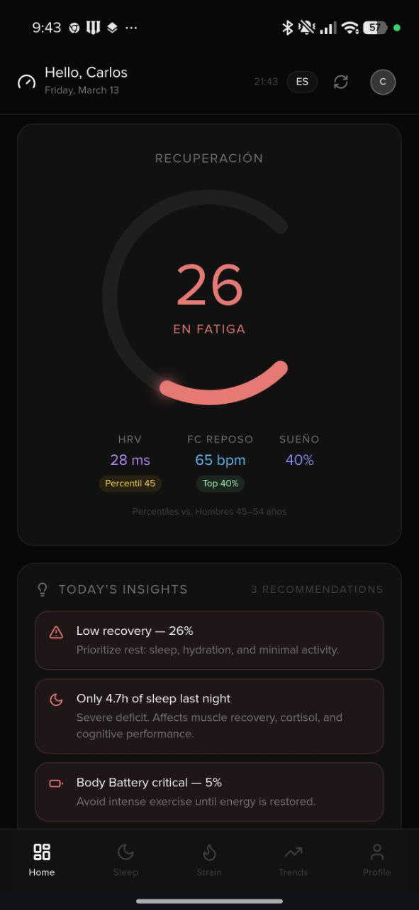
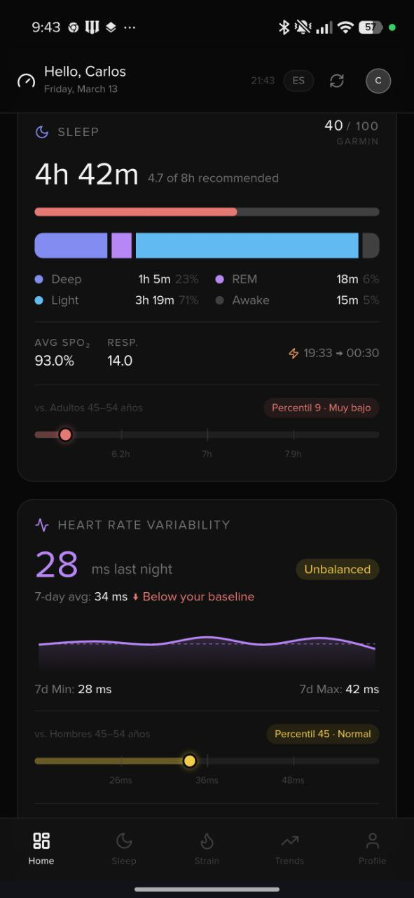
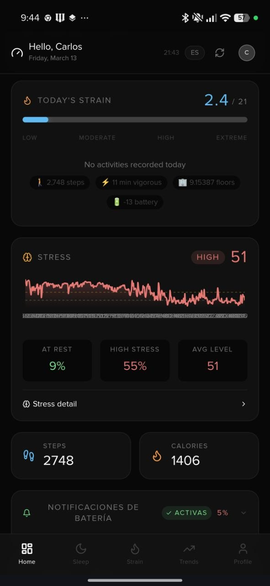
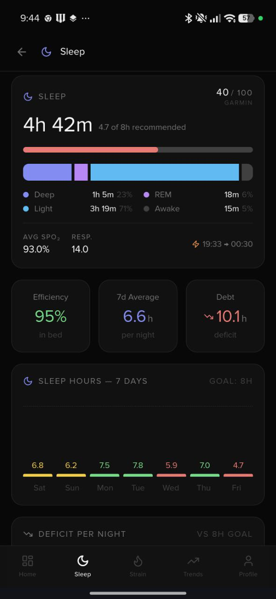
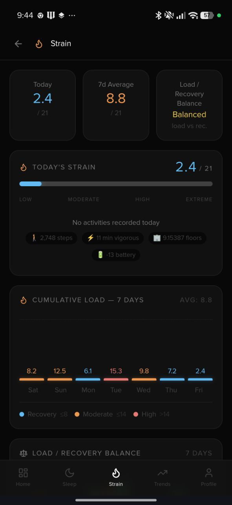

# Garmin Health Dashboard

**English** · [Español](#español)

A personal health dashboard that connects to Garmin Connect and displays your daily metrics in a clean, mobile-first interface. Works with demo data if no credentials are configured.

[](https://vercel.com/new/git/external?repository-url=https%3A%2F%2Fgithub.com%2FJJRPF%2Fgarmin-health-dashboard-gemini&env=GARMIN_USERNAME,GARMIN_PASSWORD,ANTHROPIC_API_KEY,GOOGLE_API_KEY&envDescription=Garmin%20Connect%20and%20AI%20credentials.&project-name=garmin-health-dashboard)

> **Auto-updates:** deploying with this button connects your Vercel project directly to this repository. When a new version is released, Vercel redeploys your instance automatically — no action needed on your end.

---

## Screenshots

| Dashboard | Sleep & HRV | Strain & Stress |
|-----------|-------------|-----------------|
|  |  |  |

| Sleep Detail | Strain Detail |
|--------------|---------------|
|  |  |

---

## What it does

| Screen | Metrics |
|--------|---------|
| **Dashboard** | Recovery score, HRV, Sleep, Body Battery, Strain, Stress, Steps, Calories |
| **Sleep** | Sleep stages (Deep / REM / Light / Awake), SpO₂, overnight HRV, 7-day trend |
| **Strain** | Daily strain (0–21 scale), ACWR load ratio, activities breakdown |
| **Trends** | 7 / 14 / 30-day sparklines, weekly AI summary (optional), PDF export |
| **Profile** | BMI, VO2max estimate, training zones, weight log |
| **Settings** | Configure AI Provider (Anthropic/Gemini) and API keys directly in the app |

**Key features**
- 🌐 English / Spanish toggle (auto-detects browser language)
- 🤖 AI weekly summary via **Claude Haiku** or **Google Gemini** (optional — requires API keys)
- ⚙️ **Settings UI**: Manage your AI provider and API keys directly from the browser
- 📱 Installable PWA (iOS Safari & Android Chrome)
- 🔔 Body Battery push notifications
- 🎭 Full demo mode — works without Garmin credentials
- 🔒 No database — all personal data stays in your browser (localStorage)

---

## Tech stack

- **Framework**: Next.js 14 (App Router) + TypeScript
- **Styling**: Tailwind CSS
- **Charts**: Recharts
- **Garmin**: `garmin-connect` npm package
- **AI**: Anthropic Claude Haiku & Google Gemini (optional)

---

## Deploy your own

### Option A — One-click (Vercel)

Click the **Deploy with Vercel** button above. You'll be prompted for:

| Variable | Required | Description |
|----------|----------|-------------|
| `GARMIN_USERNAME` | No | Your Garmin Connect email |
| `GARMIN_PASSWORD` | No | Your Garmin Connect password |
| `ANTHROPIC_API_KEY` | No | For AI summary (Claude Haiku) |
| `GOOGLE_API_KEY` | No | For AI summary (Gemini 1.5 Pro) |

Leave credentials empty to run in demo mode. You can also configure AI keys later via the **Settings** page in the app.

**Keeping your instance up to date**

Since your Vercel project points directly to this repository, new releases deploy to your instance automatically.

### Option B — Manual deploy

```bash
# 1. Clone
git clone https://github.com/JJRPF/garmin-health-dashboard-gemini.git
cd garmin-health-dashboard-gemini

# 2. Install dependencies
npm install

# 3. Configure environment
cp .env.example .env.local
# Edit .env.local with your credentials (all optional)

# 4. Run locally
npm run dev
# → http://localhost:3000

# 5. Deploy to Vercel
npx vercel deploy --prod
```

### Option C — Self-host (Node.js)

```bash
npm run build
npm start
# Runs on port 3000 by default
```

---

## Environment variables

```env
# Garmin Connect (optional — uses demo data if not set)
GARMIN_USERNAME=your@email.com
GARMIN_PASSWORD=yourpassword

# AI weekly summary (optional — feature hidden if no keys are provided)
# You can also set these in the app's Settings page (stored in browser)
ANTHROPIC_API_KEY=sk-ant-...
GOOGLE_API_KEY=AIza...

# Push notifications (optional — generated with npm run generate-vapid)
NEXT_PUBLIC_VAPID_PUBLIC_KEY=...
VAPID_PRIVATE_KEY=...
VAPID_EMAIL=mailto:your@email.com
```

---

## Mobile installation (PWA) · APK / Play Store

**Is there an APK or Play Store version?**
Not at this time. The app is self-hosted by design — your Garmin credentials never leave your own server. A Play Store version would require a central server storing everyone's credentials, which has significant privacy and cost implications incompatible with the open-source, zero-cost nature of this project.

**The good news:** the app is installable as a PWA directly from your browser — no app store needed, full-screen experience, home screen icon, and push notifications included.

| Platform | Steps |
|----------|-------|
| **iPhone / iPad** | Open in Safari → tap Share → "Add to Home Screen" |
| **Android** | Open in Chrome → tap menu (⋮) → "Add to Home Screen" or "Install app" |

---

## Privacy

- Garmin credentials are stored **only in your server environment** (Vercel env vars or `.env.local`)
- Health data is fetched server-side and never persisted
- Profile, weight log, and preferences are stored in **your browser's localStorage only**
- No analytics, no tracking, no third-party data collection

---

## License

MIT © 2025 — free to use, modify, and distribute. See [LICENSE](LICENSE).

---

## Support

This project is free and open-source. If it's useful to you and you'd like to say thanks, you can buy me a coffee ☕

[](https://buymeacoffee.com/cggmx)

---

# Español

Dashboard personal de salud que se conecta a Garmin Connect y muestra tus métricas diarias en una interfaz móvil limpia. Funciona con datos demo si no hay credenciales configuradas.

[](https://vercel.com/new/git/external?repository-url=https%3A%2F%2Fgithub.com%2FJJRPF%2Fgarmin-health-dashboard-gemini&env=GARMIN_USERNAME,GARMIN_PASSWORD,ANTHROPIC_API_KEY,GOOGLE_API_KEY&envDescription=Credenciales%20de%20Garmin%20y%20IA.&project-name=garmin-health-dashboard)

> **Actualizaciones automáticas:** al desplegar con este botón, tu proyecto Vercel queda conectado directamente a este repositorio. Cuando se lanza una nueva versión, Vercel redespliega tu instancia automáticamente — sin que tengas que hacer nada.

---

## Capturas de pantalla

| Dashboard | Sueño & HRV | Esfuerzo & Estrés |
|-----------|-------------|-------------------|
|  |  |  |

---

## Qué hace

| Pantalla | Métricas |
|----------|----------|
| **Dashboard** | Recuperación, HRV, Sueño, Body Battery, Esfuerzo, Estrés, Pasos, Calorías |
| **Sueño** | Fases del sueño (Profundo / REM / Ligero / Despierto), SpO₂, HRV nocturno, tendencia 7d |
| **Esfuerzo** | Esfuerzo diario (escala 0–21), ratio ACWR, desglose de actividades |
| **Tendencias** | Sparklines 7 / 14 / 30 días, resumen IA semanal (opcional), exportación PDF |
| **Perfil** | IMC, estimación VO2max, zonas de entrenamiento, registro de peso |
| **Ajustes** | Configura el proveedor de IA (Anthropic/Gemini) y claves API en la app |

**Características principales**
- 🌐 Toggle inglés / español (detecta el idioma del navegador automáticamente)
- 🤖 Resumen semanal IA con **Claude Haiku** o **Google Gemini** (opcional — requiere API keys)
- ⚙️ **Panel de Ajustes**: Gestiona tu proveedor de IA y claves API directamente en el navegador
- 📱 PWA instalable (iOS Safari y Android Chrome)
- 🔔 Notificaciones push de Body Battery
- 🎭 Modo demo completo — funciona sin credenciales de Garmin
- 🔒 Sin base de datos — todos los datos personales quedan en tu navegador (localStorage)

---

## Stack técnico

- **Framework**: Next.js 14 (App Router) + TypeScript
- **Estilos**: Tailwind CSS
- **Gráficas**: Recharts
- **Garmin**: paquete npm `garmin-connect`
- **IA**: Anthropic Claude Haiku y Google Gemini (opcional)

---

## Despliega tu propia instancia

### Opción A — Un clic (Vercel)

Haz clic en el botón **Deploy with Vercel** de arriba. Se te pedirán:

| Variable | Requerida | Descripción |
|----------|-----------|-------------|
| `GARMIN_USERNAME` | No | Tu correo de Garmin Connect |
| `GARMIN_PASSWORD` | No | Tu contraseña de Garmin Connect |
| `ANTHROPIC_API_KEY` | No | Para el resumen IA (Claude Haiku) |
| `GOOGLE_API_KEY` | No | Para el resumen IA (Gemini 1.5 Pro) |

Deja las credenciales vacías para ejecutar en modo demo. También puedes configurar las claves de IA más tarde desde la página de **Ajustes** en la app.

---

## Variables de entorno

```env
# Garmin Connect (opcional — usa datos demo si no está configurado)
GARMIN_USERNAME=tu@correo.com
GARMIN_PASSWORD=tucontraseña

# Resumen IA semanal (opcional — la función se oculta si no hay claves)
# También puedes configurar esto en la página de Ajustes de la app
ANTHROPIC_API_KEY=sk-ant-...
GOOGLE_API_KEY=AIza...

# Notificaciones push (opcional — genera con npm run generate-vapid)
NEXT_PUBLIC_VAPID_PUBLIC_KEY=...
VAPID_PRIVATE_KEY=...
VAPID_EMAIL=mailto:tu@correo.com
```

---

## Licencia

MIT © 2025 — libre de usar, modificar y distribuir. Ver [LICENSE](LICENSE).

---

## Apoya el proyecto

Esta app es gratuita y de código abierto. Si te es útil y quieres agradecerlo, puedes invitarme un café ☕

[](https://buymeacoffee.com/cggmx)
